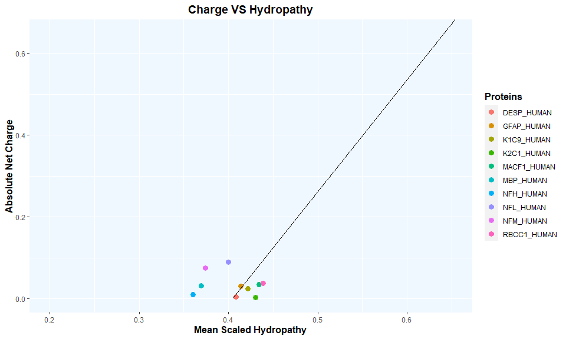
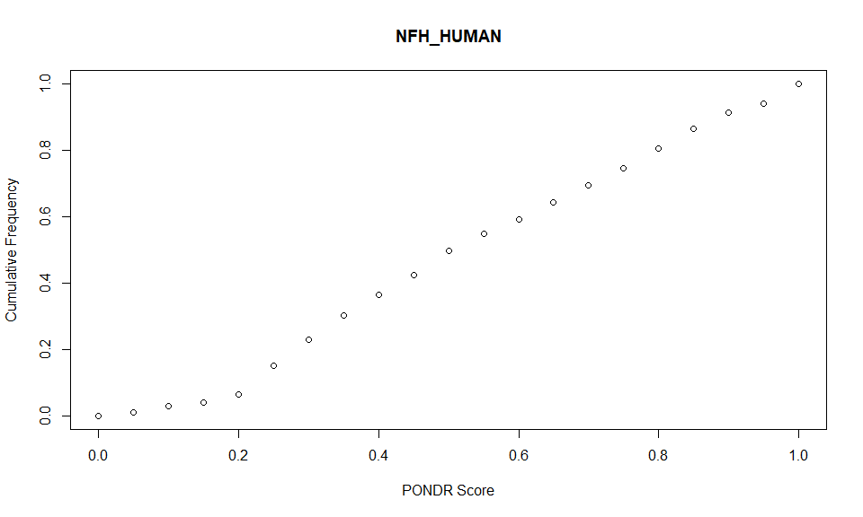
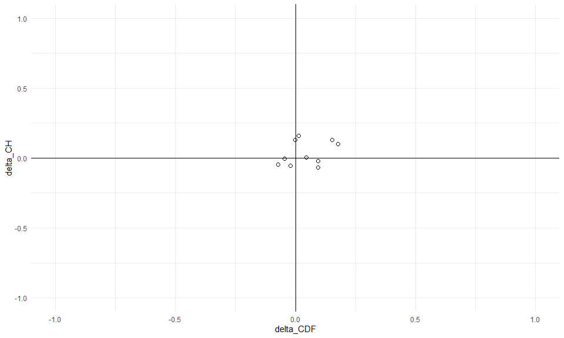
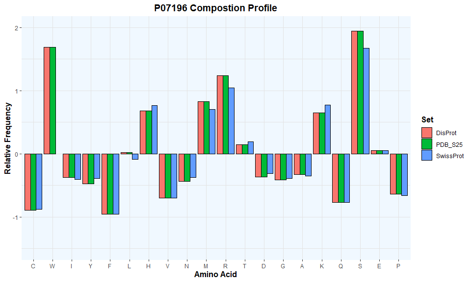

IDPAnalysis Examples
================

``` r
library(IDPAnalysis)
```

``` r

ID = as.list(read.table("C:/Users/amoha/Documents/Brain/some_ancient_IDs.txt",header=F,sep="\n"))
```

``` r

# Retrieve name, sequence, and FASTA for each protein. Output saved in PROTEINS by default
get_seq(ID)
## Please wait we are processing your accessions ...
## Please wait we are processing your accessions ...

PROTEINS$FASTA[1:2]
## [[1]]
## [[1]]$P12036
##  [1] ">sp|P12036|NFH_HUMAN Neurofilament heavy polypeptide OS=Homo sapiens OX=9606 GN=NEFH PE=1 SV=4"
##  [2] "MMSFGGADALLGAPFAPLHGGGSLHYALARKGGAGGTRSAAGSSSGFHSWTRTSVSSVSA"                                  
##  [3] "SPSRFRGAGAASSTDSLDTLSNGPEGCMVAVATSRSEKEQLQALNDRFAGYIDKVRQLEA"                                  
##  [4] "HNRSLEGEAAALRQQQAGRSAMGELYEREVREMRGAVLRLGAARGQLRLEQEHLLEDIAH"                                  
##  [5] "VRQRLDDEARQREEAEAAARALARFAQEAEAARVDLQKKAQALQEECGYLRRHHQEEVGE"                                  
##  [6] "LLGQIQGSGAAQAQMQAETRDALKCDVTSALREIRAQLEGHAVQSTLQSEEWFRVRLDRL"                                  
##  [7] "SEAAKVNTDAMRSAQEEITEYRRQLQARTTELEALKSTKDSLERQRSELEDRHQADIASY"                                  
##  [8] "QEAIQQLDAELRNTKWEMAAQLREYQDLLNVKMALDIEIAAYRKLLEGEECRIGFGPIPF"                                  
##  [9] "SLPEGLPKIPSVSTHIKVKSEEKIKVVEKSEKETVIVEEQTEETQVTEEVTEEEEKEAKE"                                  
## [10] "EEGKEEEGGEEEEAEGGEEETKSPPAEEAASPEKEAKSPVKEEAKSPAEAKSPEKEEAKS"                                  
## [11] "PAEVKSPEKAKSPAKEEAKSPPEAKSPEKEEAKSPAEVKSPEKAKSPAKEEAKSPAEAKS"                                  
## [12] "PEKAKSPVKEEAKSPAEAKSPVKEEAKSPAEVKSPEKAKSPTKEEAKSPEKAKSPEKAKS"                                  
## [13] "PEKEEAKSPEKAKSPVKAEAKSPEKAKSPVKAEAKSPEKAKSPVKEEAKSPEKAKSPVKE"                                  
## [14] "EAKSPEKAKSPVKEEAKTPEKAKSPVKEEAKSPEKAKSPEKAKTLDVKSPEAKTPAKEEA"                                  
## [15] "RSPADKFPEKAKSPVKEEVKSPEKAKSPLKEDAKAPEKEIPKKEEVKSPVKEEEKPQEVK"                                  
## [16] "VKEPPKKAEEEKAPATPKTEEKKDSKKEEAPKKEAPKPKVEEKKEPAVEKPKESKVEAKK"                                  
## [17] "EEAEDKKKVPTPEKEAPAKVEVKEDAKPKEKTEVAKKEPDDAKAKEPSKPAEKKEAAPEK"                                  
## [18] "KDTKEEKAKKPEEKPKTEAKAKEDDKTLSKEPSKPKAEKAEKSSSTDQKDSKPPEKATED"                                  
## [19] "KAAKGK"                                                                                        
## 
## 
## [[2]]
## [[2]]$P07197
##  [1] ">sp|P07197|NFM_HUMAN Neurofilament medium polypeptide OS=Homo sapiens OX=9606 GN=NEFM PE=1 SV=3"
##  [2] "MSYTLDSLGNPSAYRRVTETRSSFSRVSGSPSSGFRSQSWSRGSPSTVSSSYKRSMLAPR"                                   
##  [3] "LAYSSAMLSSAESSLDFSQSSSLLNGGSGPGGDYKLSRSNEKEQLQGLNDRFAGYIEKVH"                                   
##  [4] "YLEQQNKEIEAEIQALRQKQASHAQLGDAYDQEIRELRATLEMVNHEKAQVQLDSDHLEE"                                   
##  [5] "DIHRLKERFEEEARLRDDTEAAIRALRKDIEEASLVKVELDKKVQSLQDEVAFLRSNHEE"                                   
##  [6] "EVADLLAQIQASHITVERKDYLKTDISTALKEIRSQLESHSDQNMHQAEEWFKCRYAKLT"                                   
##  [7] "EAAEQNKEAIRSAKEEIAEYRRQLQSKSIELESVRGTKESLERQLSDIEERHNHDLSSYQ"                                   
##  [8] "DTIQQLENELRGTKWEMARHLREYQDLLNVKMALDIEIAAYRKLLEGEETRFSTFAGSIT"                                   
##  [9] "GPLYTHRPPITISSKIQKPKVEAPKLKVQHKFVEEIIEETKVEDEKSEMEEALTAITEEL"                                   
## [10] "AVSMKEEKKEAAEEKEEEPEAEEEEVAAKKSPVKATAPEVKEEEGEKEEEEGQEEEEEED"                                   
## [11] "EGAKSDQAEEGGSEKEGSSEKEEGEQEEGETEAEAEGEEAEAKEEKKVEEKSEEVATKEE"                                   
## [12] "LVADAKVEKPEKAKSPVPKSPVEEKGKSPVPKSPVEEKGKSPVPKSPVEEKGKSPVPKSP"                                   
## [13] "VEEKGKSPVSKSPVEEKAKSPVPKSPVEEAKSKAEVGKGEQKEEEEKEVKEAPKEEKVEK"                                   
## [14] "KEEKPKDVPEKKKAESPVKEEAVAEVVTITKSVKVHLEKETKEEGKPLQQEKEKEKAGGE"                                   
## [15] "GGSEEEGSDKGAKGSRKEDIAVNGEVEGKEEVEQETKEKGSGREEEKGVVTNGLDLSPAD"                                   
## [16] "EKKGGDKSEEKVVVTKTVEKITSEGGDGATKYITKSVTVTQKVEEHEETFEEKLVSTKKV"                                   
## [17] "EKVTSHAIVKEVTQSD"
```

``` r

# Run PONDR VLXT for each protein. Data stored in PONDR_VLXT by default. Firefox must be installed to use this function.

VLXT(PROTEINS$FASTA, PROTEINS$ID)
## checking Selenium Server versions:
## BEGIN: PREDOWNLOAD
## BEGIN: DOWNLOAD
## BEGIN: POSTDOWNLOAD
## checking chromedriver versions:
## BEGIN: PREDOWNLOAD
## BEGIN: DOWNLOAD
## BEGIN: POSTDOWNLOAD
## checking geckodriver versions:
## BEGIN: PREDOWNLOAD
## BEGIN: DOWNLOAD
## BEGIN: POSTDOWNLOAD
## checking phantomjs versions:
## BEGIN: PREDOWNLOAD
## BEGIN: DOWNLOAD
## BEGIN: POSTDOWNLOAD
## Warning in rm(webElem): object 'webElem' not found
```

``` r

plot_CH(PROTEINS$SEQUENCE,PROTEINS$NAME)
```

<!-- -->

``` r

CDF <- get_CDF(PONDR_VLXT,PROTEINS$NAME)
```

``` r

plot_CDF(CDF[1])
```

<!-- -->

    ## NULL

``` r

d_CDF <- delta_CDF(CDF)

d_CDF
##           delta_CDF
## P12036 -0.001740462
## P07197  0.014192140
## P07196  0.177519074
## P14136  0.045965608
## P02686  0.151785714
## P35527  0.094875029
## P15924 -0.046487038
## Q9UPN3 -0.073420218
## Q8TDY2 -0.022091773
## P04264  0.092724046
```

``` r

d_CH <- delta_CH(PROTEINS$SEQUENCE, PROTEINS$ID)

d_CH
##            delta_CH
## P12036  0.130474071
## P07197  0.158074188
## P07196  0.101978792
## P14136  0.003820769
## P02686  0.128924688
## P35527 -0.022454348
## P15924 -0.006053002
## Q9UPN3 -0.047051079
## Q8TDY2 -0.055998175
## P04264 -0.067912565
```

``` r

plot_CH_CDF(d_CDF,d_CH)
```

<!-- -->

``` r

cprof(PROTEINS$SEQUENCE[3], PROTEINS$ID[3])
## Warning: Removed 1 rows containing missing values (geom_bar).
```

<!-- -->
