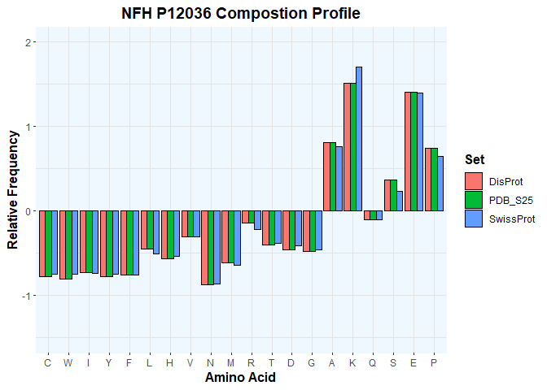

PDAnalysis Example
================
Aaron\_M
4/24/2021

``` r
library(stringr)
library(purrr)
library(ggplot2)

s <- c('MMSFGGADALLGAPFAPLHGGGSLHYALARKGGAGGTRSAAGSSSGFHSWTRTSVSSVSA
SPSRFRGAGAASSTDSLDTLSNGPEGCMVAVATSRSEKEQLQALNDRFAGYIDKVRQLEA
HNRSLEGEAAALRQQQAGRSAMGELYEREVREMRGAVLRLGAARGQLRLEQEHLLEDIAH
VRQRLDDEARQREEAEAAARALARFAQEAEAARVDLQKKAQALQEECGYLRRHHQEEVGE
LLGQIQGSGAAQAQMQAETRDALKCDVTSALREIRAQLEGHAVQSTLQSEEWFRVRLDRL
SEAAKVNTDAMRSAQEEITEYRRQLQARTTELEALKSTKDSLERQRSELEDRHQADIASY
QEAIQQLDAELRNTKWEMAAQLREYQDLLNVKMALDIEIAAYRKLLEGEECRIGFGPIPF
SLPEGLPKIPSVSTHIKVKSEEKIKVVEKSEKETVIVEEQTEETQVTEEVTEEEEKEAKE
EEGKEEEGGEEEEAEGGEEETKSPPAEEAASPEKEAKSPVKEEAKSPAEAKSPEKEEAKS
PAEVKSPEKAKSPAKEEAKSPPEAKSPEKEEAKSPAEVKSPEKAKSPAKEEAKSPAEAKS
PEKAKSPVKEEAKSPAEAKSPVKEEAKSPAEVKSPEKAKSPTKEEAKSPEKAKSPEKAKS
PEKEEAKSPEKAKSPVKAEAKSPEKAKSPVKAEAKSPEKAKSPVKEEAKSPEKAKSPVKE
EAKSPEKAKSPVKEEAKTPEKAKSPVKEEAKSPEKAKSPEKAKTLDVKSPEAKTPAKEEA
RSPADKFPEKAKSPVKEEVKSPEKAKSPLKEDAKAPEKEIPKKEEVKSPVKEEEKPQEVK
VKEPPKKAEEEKAPATPKTEEKKDSKKEEAPKKEAPKPKVEEKKEPAVEKPKESKVEAKK
EEAEDKKKVPTPEKEAPAKVEVKEDAKPKEKTEVAKKEPDDAKAKEPSKPAEKKEAAPEK
KDTKEEKAKKPEEKPKTEAKAKEDDKTLSKEPSKPKAEKAEKSSSTDQKDSKPPEKATED
KAAKGK','MSYTLDSLGNPSAYRRVTETRSSFSRVSGSPSSGFRSQSWSRGSPSTVSSSYKRSMLAPR
LAYSSAMLSSAESSLDFSQSSSLLNGGSGPGGDYKLSRSNEKEQLQGLNDRFAGYIEKVH
YLEQQNKEIEAEIQALRQKQASHAQLGDAYDQEIRELRATLEMVNHEKAQVQLDSDHLEE
DIHRLKERFEEEARLRDDTEAAIRALRKDIEEASLVKVELDKKVQSLQDEVAFLRSNHEE
EVADLLAQIQASHITVERKDYLKTDISTALKEIRSQLESHSDQNMHQAEEWFKCRYAKLT
EAAEQNKEAIRSAKEEIAEYRRQLQSKSIELESVRGTKESLERQLSDIEERHNHDLSSYQ
DTIQQLENELRGTKWEMARHLREYQDLLNVKMALDIEIAAYRKLLEGEETRFSTFAGSIT
GPLYTHRPPITISSKIQKPKVEAPKLKVQHKFVEEIIEETKVEDEKSEMEEALTAITEEL
AVSMKEEKKEAAEEKEEEPEAEEEEVAAKKSPVKATAPEVKEEEGEKEEEEGQEEEEEED
EGAKSDQAEEGGSEKEGSSEKEEGEQEEGETEAEAEGEEAEAKEEKKVEEKSEEVATKEE
LVADAKVEKPEKAKSPVPKSPVEEKGKSPVPKSPVEEKGKSPVPKSPVEEKGKSPVPKSP
VEEKGKSPVSKSPVEEKAKSPVPKSPVEEAKSKAEVGKGEQKEEEEKEVKEAPKEEKVEK
KEEKPKDVPEKKKAESPVKEEAVAEVVTITKSVKVHLEKETKEEGKPLQQEKEKEKAGGE
GGSEEEGSDKGAKGSRKEDIAVNGEVEGKEEVEQETKEKGSGREEEKGVVTNGLDLSPAD
EKKGGDKSEEKVVVTKTVEKITSEGGDGATKYITKSVTVTQKVEEHEETFEEKLVSTKKV
EKVTSHAIVKEVTQSD','MSSFSYEPYYSTSYKRRYVETPRVHISSVRSGYSTARSAYSSYSAPVSSSLSVRRSYSSS
SGSLMPSLENLDLSQVAAISNDLKSIRTQEKAQLQDLNDRFASFIERVHELEQQNKVLEA
ELLVLRQKHSEPSRFRALYEQEIRDLRLAAEDATNEKQALQGEREGLEETLRNLQARYEE
EVLSREDAEGRLMEARKGADEAALARAELEKRIDSLMDEISFLKKVHEEEIAELQAQIQY
AQISVEMDVTKPDLSAALKDIRAQYEKLAAKNMQNAEEWFKSRFTVLTESAAKNTDAVRA
AKDEVSESRRLLKAKTLEIEACRGMNEALEKQLQELEDKQNADISAMQDTINKLENELRT
TKSEMARYLKEYQDLLNVKMALDIEIAAYRKLLEGEETRLSFTSVGSITSGYSQSSQVFG
RSAYGGLQTSSYLMSTRSFPSYYTSHVQEEQIEVEETIEAAKAEEAKDEPPSEGEAEEEE
KDKEEAEEEEAAEEEEAAKEESEEAKEEEEGGEGEEGEETKEAEEEEKKVEGAGEEQAAK
KKD','MERRRITSAARRSYVSSGEMMVGGLAPGRRLGPGTRLSLARMPPPLPTRVDFSLAGALNA
GFKETRASERAEMMELNDRFASYIEKVRFLEQQNKALAAELNQLRAKEPTKLADVYQAEL
RELRLRLDQLTANSARLEVERDNLAQDLATVRQKLQDETNLRLEAENNLAAYRQEADEAT
LARLDLERKIESLEEEIRFLRKIHEEEVRELQEQLARQQVHVELDVAKPDLTAALKEIRT
QYEAMASSNMHEAEEWYRSKFADLTDAAARNAELLRQAKHEANDYRRQLQSLTCDLESLR
GTNESLERQMREQEERHVREAASYQEALARLEEEGQSLKDEMARHLQEYQDLLNVKLALD
IEIATYRKLLEGEENRITIPVQTFSNLQIRETSLDTKSVSEGHLKRNIVVKTVEMRDGEV
IKESKQEHKDVM','MGNHAGKRELNAEKASTNSETNRGESEKKRNLGELSRTTSEDNEVFGEADANQNNGTSSQ
DTAVTDSKRTADPKNAWQDAHPADPGSRPHLIRLFSRDAPGREDNTFKDRPSESDELQTI
QEDSAATSESLDVMASQKRPSQRHGSKYLATASTMDHARHGFLPRHRDTGILDSIGRFFG
GDRGAPKRGSGKDSHHPARTAHYGSLPQKSHGRTQDENPVVHFFKNIVTPRTPPPSQGKG
RGLSLSRFSWGAEGQRPGFGYGGRASDYKSAHKGFKGVDAQGTLSKIFKLGGRDSRSGSP
MARR')

names <- c('NFH P12036','NFM P07197','NFL P07196','GFAP P14136','MBP P02686')
```

``` r
chplot <- function(sequences,names) {

  # Saves the input sequences into a data frame
  sequence <- data.frame(sequences)

  # Adds the protein names to the sequence data frame
  row.names(sequence) <- names

  # Data frame which contains the charges and hydropathies of each residue
  # (amino acid)
  charge_hydropathy <- data.frame(charge = c(0, 0, 0, 0, 0, 0, 0, 0, 0, 0, 0, 1,
  0, -1, 0, 0, 0, -1, 1, 0), IDP_hydropathy = c(0.4, 0.355, 1, 0.811, 0.777,
  0.922, 0.966, 0.711, 0.111, 0.422, 0.7, 0, 0.455, 0.111, 0.111, 0.411, 0.144,
  0.111, 0.066, 0.322))

  # Names of each residue
  row.names(charge_hydropathy) <- c('W','Y','I','F','C','L','V','M','N','T',
                                    'A','R','G','D','Q','S','H','E','K','P')

  # Counts the number of each residue in each protein
  count <- data.frame(W = str_count(sequence$s,'W'),Y = str_count(sequence$s,'Y'),
                      I = str_count(sequence$s,'I'),F = str_count(sequence$s,'F'),
                      C = str_count(sequence$s,'C'),L = str_count(sequence$s,'L'),
                      V = str_count(sequence$s,'V'),M = str_count(sequence$s,'M'),
                      N = str_count(sequence$s,'N'),T = str_count(sequence$s,'T'),
                      A = str_count(sequence$s,'A'),R = str_count(sequence$s,'R'),
                      G = str_count(sequence$s,'G'),D = str_count(sequence$s,'D'),
                      Q = str_count(sequence$s,'Q'),S = str_count(sequence$s,'S'),
                      H = str_count(sequence$s,'H'),E = str_count(sequence$s,'E'),
                      K = str_count(sequence$s,'K'),P = str_count(sequence$s,'P'))

  # Calculates the total hydropathy contributed by each residue
  H <- data.frame(W_H = count['W']*charge_hydropathy['W',"IDP_hydropathy"],
                  Y_H = count['Y']*charge_hydropathy['Y',"IDP_hydropathy"],
                  I_H = count['I']*charge_hydropathy['I',"IDP_hydropathy"],
                  F_H = count['F']*charge_hydropathy['F',"IDP_hydropathy"],
                  C_H = count['C']*charge_hydropathy['C',"IDP_hydropathy"],
                  L_H = count['L']*charge_hydropathy['L',"IDP_hydropathy"],
                  V_H = count['V']*charge_hydropathy['V',"IDP_hydropathy"],
                  M_H = count['M']*charge_hydropathy['M',"IDP_hydropathy"],
                  N_H = count['N']*charge_hydropathy['N',"IDP_hydropathy"],
                  T_H = count['T']*charge_hydropathy['T',"IDP_hydropathy"],
                  A_H = count['A']*charge_hydropathy['A',"IDP_hydropathy"],
                  R_H = count['R']*charge_hydropathy['R',"IDP_hydropathy"],
                  G_H = count['G']*charge_hydropathy['G',"IDP_hydropathy"],
                  D_H = count['D']*charge_hydropathy['D',"IDP_hydropathy"],
                  Q_H = count['Q']*charge_hydropathy['Q',"IDP_hydropathy"],
                  S_H = count['S']*charge_hydropathy['S',"IDP_hydropathy"],
                  H_H = count['H']*charge_hydropathy['H',"IDP_hydropathy"],
                  E_H = count['E']*charge_hydropathy['E',"IDP_hydropathy"],
                  K_H = count['K']*charge_hydropathy['K',"IDP_hydropathy"],
                  P_H = count['P']*charge_hydropathy['P',"IDP_hydropathy"])

  # Counts the total number of residues in each protein
  n_s <- nchar(sequences)

  # Calculates the net hydropathy of each protein
  s_H <- rowSums(H)

  # Calculates the mean net hydropathy of each protein
  mean_H <- s_H/n_s

  # Calculates the total charge contributed by each residue
  C <- data.frame(W_C = count['W']*charge_hydropathy['W',"charge"],
                  Y_C = count['Y']*charge_hydropathy['Y',"charge"],
                  I_C = count['I']*charge_hydropathy['I',"charge"],
                  F_C= count['F']*charge_hydropathy['F',"charge"],
                  C_C= count['C']*charge_hydropathy['C',"charge"],
                  L_C= count['L']*charge_hydropathy['L',"charge"],
                  V_C= count['V']*charge_hydropathy['V',"charge"],
                  M_C= count['M']*charge_hydropathy['M',"charge"],
                  N_C= count['N']*charge_hydropathy['N',"charge"],
                  T_C= count['T']*charge_hydropathy['T',"charge"],
                  A_C= count['A']*charge_hydropathy['A',"charge"],
                  R_C= count['R']*charge_hydropathy['R',"charge"],
                  G_C= count['G']*charge_hydropathy['G',"charge"],
                  D_C= count['D']*charge_hydropathy['D',"charge"],
                  Q_C= count['Q']*charge_hydropathy['Q',"charge"],
                  S_C= count['S']*charge_hydropathy['S',"charge"],
                  H_C= count['H']*charge_hydropathy['H',"charge"],
                  E_C= count['E']*charge_hydropathy['E',"charge"],
                  K_C= count['K']*charge_hydropathy['K',"charge"],
                  P_C= count['P']*charge_hydropathy['P',"charge"])

  # Calculates the total charge of each protein
  s_C <- rowSums(C)

  # Calculates the mean net charge of each protein
  mean_C <- s_C/n_s

  # Takes the absolute value of the mean net charge
  mean_C <- abs(mean_C)

  # Stores the values of the mean hydropathy and mean charge in a data frame
  d <- data.frame(mean_H,mean_C,Proteins=names,line_color='black')

  plot <- ggplot(d,aes(mean_H,mean_C,colour=Proteins))+
  ggtitle("Charge VS Hydropathy")+ 
  theme(plot.title = element_text(hjust = 0.5))+
  xlab("Mean Scaled Hydropathy") + 
  ylab("Absolute Net Charge")+
  coord_cartesian(xlim = c(0.2,0.65), ylim = c(0,0.65))+
  geom_point()+
  geom_segment(aes(x = c(0.4043), y = c(0), xend = c(0.6777), yend = c(0.75)),            color='black')+
  theme(panel.background = element_rect(fill = "aliceblue",color = "aliceblue"),
  title =element_text(size=12,face='bold'))+
  geom_point(size=3)

  dir <- getwd()
  dir <- paste0(dir,'/chplot.png')
  ggsave(dir, width= 9, height= 5)

  print(plot)

}
```

``` r
cprof <- function(sequences,names) {

  # Saves the input sequences into a data frame
  sequence <- data.frame(sequences)

  # Adds the protein names to the sequence data frame
  row.names(sequence) <- names

  # Data frame which contains the reference data sets. Each data set contains
  # the average frequency of each residue (amino acid) in a set proteins.
  # SwissProt is a set which attempts to represent the frequency of residues
  # in nature, PDB_S25 contains crystalizable proteins, and DisProt contains
  # intrinically disordered proteins.
  profile_ref <- data.frame(SwissProt = c(1.5, 1.13, 5.9, 3.03, 3.96, 9.65, 2.29,
  6.73, 4.13, 2.38, 5.4, 5.41, 5.35, 6.96, 7.89, 5.92, 3.95, 6.83, 6.67, 4.83),
  PDB_S25= c(1.74, 1.44, 5.61, 3.5, 3.98, 8.68, 2.41, 6.72, 4.58, 2.22, 4.93,
  5.63, 5.83, 7.16, 7.7, 6.37, 3.95, 6.19, 6.65, 4.57), DisProt = c(0.8, 0.67,
  3.24, 2.13, 2.44, 6.22, 1.93, 5.41, 3.82, 1.87, 4.82, 5.56, 5.8, 7.41, 8.1,
  7.85, 5.27, 8.65, 9.89, 8.11))

  # Names of each residue
  row.names(profile_ref) <- c('C','W','I','Y','F','L','H','V','N','M','R','T',
                              'D','G', 'A','K','Q','S','E','P')

  # Counts the number of each residue in each protein
  count <- data.frame(C = str_count(sequence$s,'C'),W = str_count(sequence$s,'W'),
                      I = str_count(sequence$s,'I'),Y = str_count(sequence$s,'Y'),
                      F = str_count(sequence$s,'F'),L = str_count(sequence$s,'L'),
                      H = str_count(sequence$s,'H'),V = str_count(sequence$s,'V'),
                      N = str_count(sequence$s,'N'),M = str_count(sequence$s,'M'),
                      R = str_count(sequence$s,'R'),T = str_count(sequence$s,'T'),
                      D = str_count(sequence$s,'D'),G = str_count(sequence$s,'G'),
                      A = str_count(sequence$s,'A'),K = str_count(sequence$s,'K'),
                      Q = str_count(sequence$s,'Q'),S = str_count(sequence$s,'S'),
                      E = str_count(sequence$s,'K'),P = str_count(sequence$s,'P'))

  # Counts the total number of residues in each protein
  n_s <- nchar(sequences)

  # Calculates the frequency of each residue in each protein
  freq <- count/n_s

  # Calculates the percent frequency
  freq <- freq*100

  Swiss_prof <- list()
  PDB_S25_prof <- list()
  DisProt_prof <- list()
  prof <- vector(mode = 'list', length = length(s))

  # Calculates the relative frequency of each residue based on each data set and
  # stores them in lists
  for (i in 1:length(s)) {

    Swiss_prof[[i]] <- (freq[i,] - profile_ref[,1])/profile_ref[,1]

    PDB_S25_prof[[i]] <- (freq[i,] - profile_ref[,2])/profile_ref[,2]

    DisProt_prof[[i]] <- (freq[i,] - profile_ref[,3])/profile_ref[,3]

    prof[[i]][[1]] <- Swiss_prof[[i]]
    prof[[i]][[2]] <- PDB_S25_prof[[i]]
    prof[[i]][[3]] <- PDB_S25_prof[[i]]

  }

  for (i in 1:length(s)) {

    # Extracts data from the lists and stores them in arrays
    array1 <- array(as.numeric(unlist(prof[[i]][[1]])), dim = c(20,1))
    array2 <- array(as.numeric(unlist(prof[[i]][[2]])), dim = c(20,1))
    array3 <- array(as.numeric(unlist(prof[[i]][[3]])), dim = c(20,1))

  prof_array <- rbind(array1,array2,array3)

  residues <- row.names(profile_ref)

  sets <- rep(c('SwissProt','PDB_S25','DisProt'),each=20)

  profile <- data.frame(freq=prof_array,residues=residues,Set=sets)

  profile$residues <- factor(profile$residues, levels = row.names(profile_ref))
  
  title <- paste(names[i],'Compostion Profile',sep=" ")

  plot<-ggplot(profile, aes(x=residues, y=freq, fill=Set))+ 
  geom_bar(stat="identity", position=position_dodge(),color='black')+
  theme(panel.background = element_rect(fill = "aliceblue",color = "aliceblue"),
  panel.grid.major = element_line(size = 0.2, linetype = 'solid', colour = "gray89"), 
  panel.grid.minor = element_line(size = 0.2, linetype = 'solid', colour = "gray89"))+
  xlab('Amino Acid')+
  ylab('Relative Frequency')+
  ylim(-1.5,2)+
  ggtitle(title)+
  theme(plot.title = element_text(hjust = 0.5),title =element_text(size=12,face='bold'))


  n <- as.character(i)
  dir <- getwd()
  dir <- paste0(dir,'/cprof_',n,'.png')
  ggsave(dir, width= 9, height= 5)

  print(plot)

}

}
```

``` r
chplot(s,names)
```

<!-- -->

``` r
cprof(s,names)
```

<!-- --><!-- --><!-- --><!-- --><!-- -->
